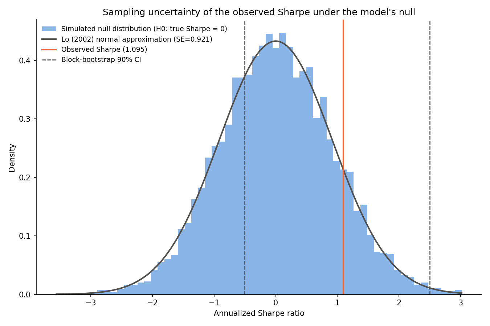
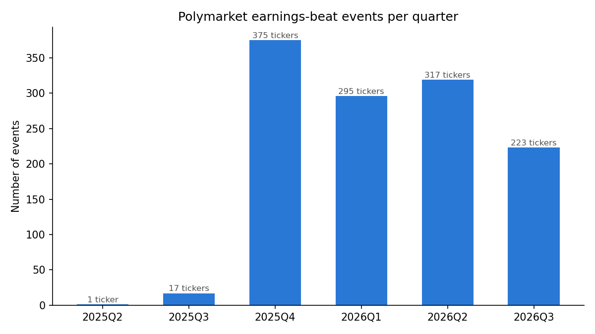
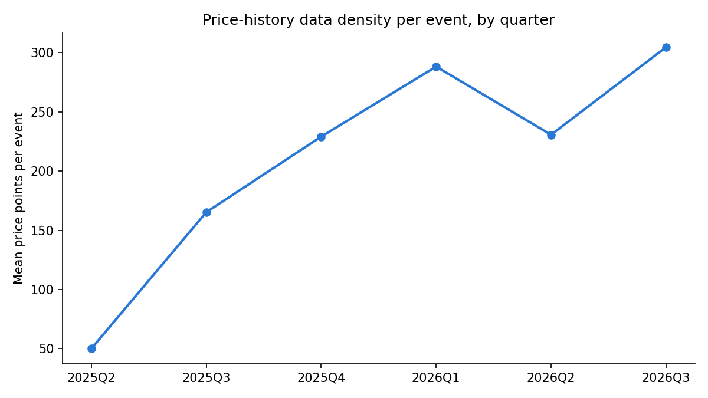
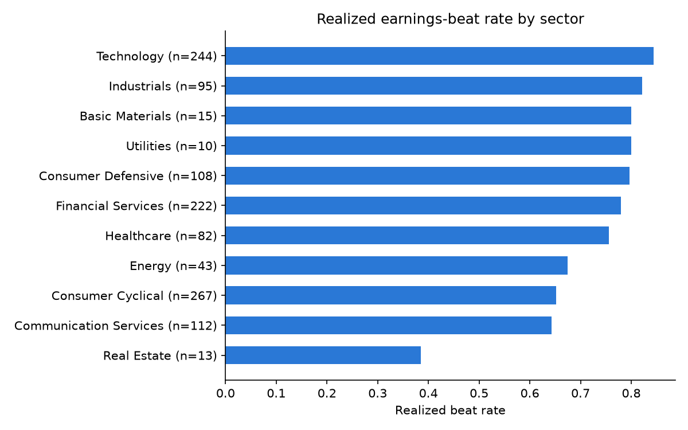
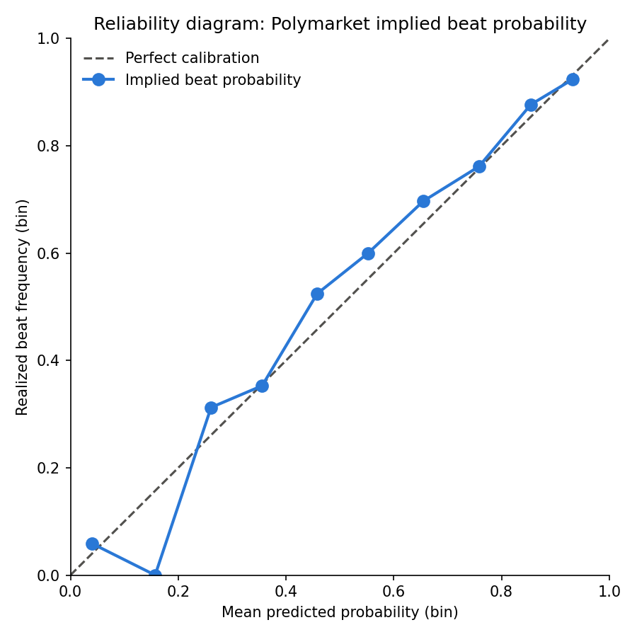
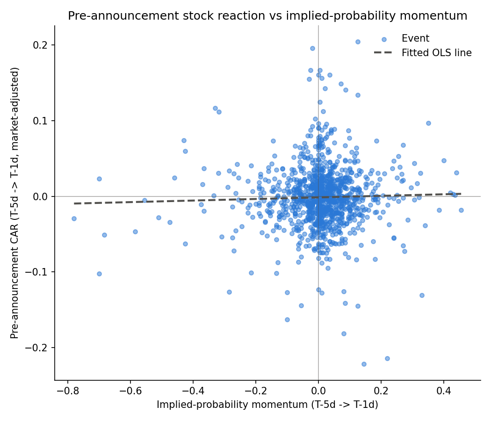
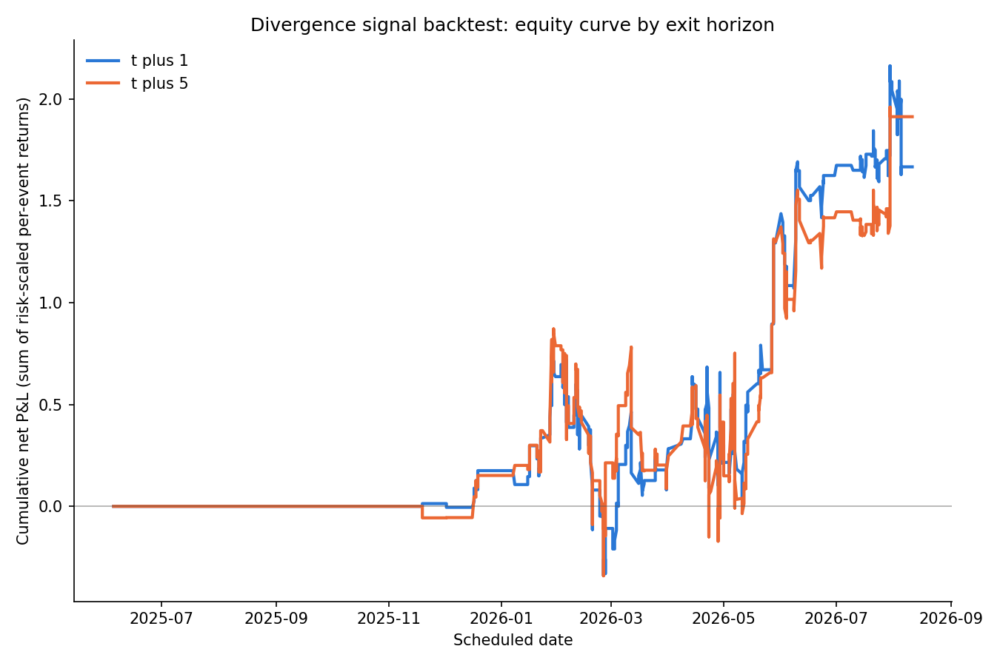
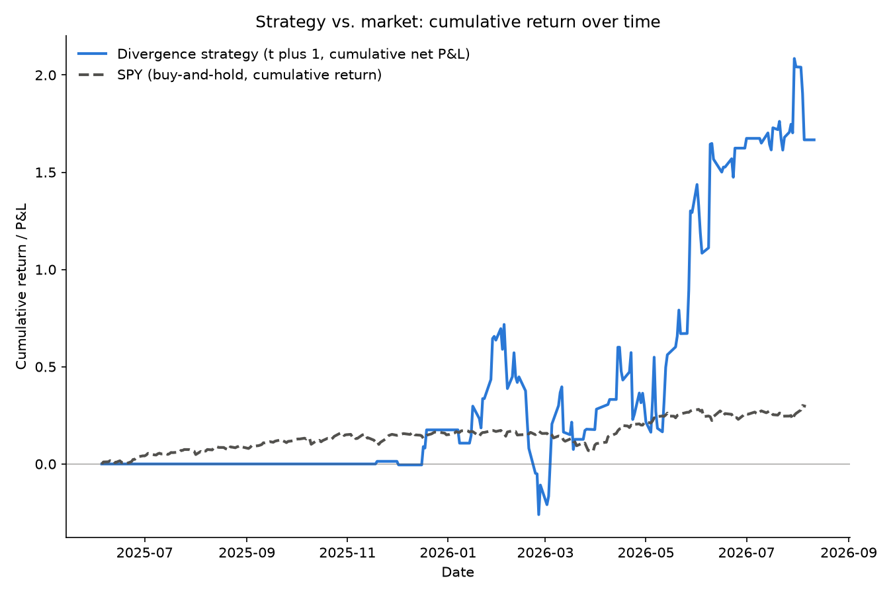

# Do Prediction Markets Know Earnings Before Wall Street Does? Evidence from Polymarket's Corporate Earnings Contracts

## Abstract

Prediction markets that let traders bet on whether a company will beat its quarterly earnings estimate offer a real-time forecast of corporate performance, distinct from analyst consensus or option-implied volatility. This paper tests whether Polymarket's "Will [company] beat quarterly earnings?" contracts predict earnings surprises beyond a firm's own historical beat rate, and whether that information is tradable. The sample covers 1,231 resolved contracts across roughly 415 companies, June 2025 through August 2026, and yields three findings. First, Polymarket's implied beat probability is well-calibrated and beats a firm-history baseline on Brier score (0.149 versus 0.185); the gap's 90 percent bootstrap confidence interval, [0.027, 0.042], excludes zero. Second, a logistic encompassing regression gives the market's implied probability a large, highly significant coefficient (5.78, p < 10⁻³⁵) that survives three clustering-robust inference procedures and beats the firm-history-only model in a likelihood ratio test. The probability's short-run momentum before the print adds no further predictive power, and it does not forecast the stock's own pre-announcement price reaction either. Third, a volatility-targeted trading strategy built on the divergence between price and firm history beats both a buy-and-hold benchmark and a firm-history-only rule in-sample, at both a one-day and a five-day exit horizon. A permutation test, a block-bootstrap confidence interval on the Sharpe ratio, and a Jobson-Korkie test against buy-and-hold all agree that this edge does not clear a conventional significance threshold once same-day earnings clustering is accounted for. The market's price is genuinely informative. Whether that information is a confirmed trading edge remains open, given an effective sample of roughly 181 independent trading dates. These two facts are not in tension: a stylized noisy rational-expectations model in the tradition of Grossman and Stiglitz (1980), Hellwig (1980), and Kyle (1985) predicts exactly this pairing, since price informativeness and zero expected profit from trading a price that already reflects public information are two faces of the same equilibrium. A numerical illustration built from this paper's own backtest confirms it: the observed Sharpe ratio sits comfortably inside the sampling distribution the model implies under its own null. We discuss implications for market efficiency, the design of consensus-adjacent information sources, and directions for extending the sample as Polymarket's earnings product matures.

## Introduction

On August 4, 2026, Polymarket priced Palantir Technologies at roughly 93 percent to beat its second-quarter earnings estimate. Two days later the company reported results that beat consensus and its shares rose sharply. That anecdote is the kind of story that motivates a broader question: do event-contract markets like Polymarket, which let anyone bet directly on a well-defined corporate outcome, actually know something before the rest of the market does, or is a single striking prediction simply survivorship bias dressed up as insight?

This paper answers that question with data, not anecdote. Polymarket runs "Will [company] beat quarterly earnings?" as a systematic, recurring product, not a one-off novelty: 1,231 contracts resolved between June 2025 and August 2026, across roughly 415 distinct companies. Each contract carries a posted consensus EPS estimate and a continuously updated implied probability, visible from creation through resolution. That scale and cadence give real statistical power to two questions: does the market's price contain information beyond what a firm's own history of beats and misses already reveals, and could a trader have captured that information as a systematic strategy rather than one lucky call?

The market's price carries real information. That is this paper's central empirical claim. Polymarket's implied probability is close to well-calibrated across the range where most trading activity occurs, and it substantially outperforms a firm-specific historical base rate as a forecast of the actual outcome, both in a direct scoring-rule comparison and in a regression that nests the two forecasts against each other. The result holds under three different approaches to clustering standard errors. Clustering matters here because many companies report earnings on the same handful of dates each quarter and share exposure to the same market-wide shocks on those days.

The secondary, more cautious claim concerns tradability. A strategy that goes long or short a company's stock ahead of its earnings print, sized by the divergence between the market's implied probability and the firm's historical beat rate, outperforms both a naive buy-and-hold approach and a firm-history-only strategy, at both exit horizons tested. But the sample's effective size for inference is much smaller than its raw event count suggests. Earnings reports cluster heavily on a handful of dates each quarter, so the 1,231 events collapse to roughly 181 independent trading dates once that clustering is respected. A permutation test, a block bootstrap, and a Jobson-Korkie test against buy-and-hold all show the same thing: the strategy's apparent edge is suggestive, not statistically confirmed at conventional thresholds. We report this plainly rather than overstate a result the evidence does not fully support.

Together, these two facts raise a question this paper takes as seriously as either fact alone. Is "informative but not exploitable" a puzzle requiring reconciliation, or the ordinary signature of an efficient market absorbing dispersed private information? We argue the latter, and formalize why with a stylized equilibrium model before turning to the data.

The paper proceeds as follows. Section 2 surveys the literature on prediction-market efficiency and the closest empirical precedent: a 2026 Federal Reserve working paper evaluating Kalshi, Polymarket's sibling platform, against Bloomberg consensus for macroeconomic releases. Section 3 develops a stylized noisy rational-expectations model connecting price informativeness to trading profitability, and states three propositions the empirical results are read against. Section 4 covers the data and methodology in five parts: the data (4.1), descriptive characteristics of the sample (4.2), a calibration and encompassing-regression test of informational content (4.3), a test of whether the stock's own pre-announcement price reaction anticipates the market's signal (4.4), and a volatility-targeted backtest with formal significance testing (4.5). Section 5 presents results and discusses their implications against Section 3's propositions. Section 6 concludes and outlines directions for extending the analysis as Polymarket's earnings-contract coverage grows.

## Literature Survey

Markets aggregate dispersed information into prices more efficiently than any single forecaster. That idea is foundational to the prediction-market literature. Plott and Sunder (1988) showed experimentally that double-auction markets aggregate private information held by individual traders into a price reflecting the pooled information set, even when no single trader holds enough information to make the correct call alone. Field evidence followed: the Iowa Electronic Markets, running since 1988, produced presidential-election vote-share forecasts closer to the eventual outcome than contemporaneous opinion polls, in roughly 74 percent of 964 direct comparisons across the 1988-2004 election cycles (Berg, Nelson, and Rietz, 2008).

The most directly relevant precedent is a 2026 Federal Reserve Finance and Economics Discussion Series working paper by Diercks, Katz, and Wright, "Kalshi and the Rise of Macro Markets" (SSRN 6333085). The authors evaluate Kalshi's macroeconomic event contracts, covering Federal Reserve rate decisions, CPI releases, and jobs reports, against Bloomberg's survey-based consensus forecasts. For headline CPI, Kalshi's implied expectations deliver a statistically significant improvement in forecast accuracy over Bloomberg consensus. For core CPI and the unemployment rate, Kalshi's accuracy is statistically indistinguishable from Bloomberg's, not superior. Their framing is that a CFTC-regulated event-contract exchange can be benchmarked directly against an established professional forecasting product using standard forecast-encompassing methodology. This paper adapts that template to earnings forecasting, with two departures. First, the benchmark here is a firm's own historical tendency to beat or miss its estimates, not a survey of professional forecasters: no free, systematic, point-in-time analyst-consensus panel for corporate earnings across hundreds of tickers was available for this study, and a firm-specific historical base rate is a defensible, if more modest, substitute, one a sophisticated trader could plausibly already know without paying for any data. Second, this paper extends the encompassing framework to ask not only whether the market's price level adds information, but whether the price's trajectory in the days before the print does too, a question that bears more directly on whether the market's edge could be captured through a trading strategy rather than only observed after the fact.

This paper's contribution relative to both anchors is to move the encompassing-market question from macroeconomic releases to firm-level corporate earnings. Macroeconomic releases are single, simultaneous, economy-wide events. Corporate earnings recur hundreds of times a quarter, which lets the same test run with cross-sectional, not just time-series, statistical power. Diercks, Katz, and Wright ask whether one market beats one consensus forecast, release after release. This paper asks whether a market's price beats a firm-specific baseline across hundreds of distinct companies at once, and whether any resulting edge survives the panel's own clustering structure once it is used to trade.

The trading-strategy portion of this paper also connects to the older literature on post-earnings-announcement drift: stock prices do not fully and immediately incorporate the information in an earnings surprise, so returns continue to drift in the direction of the surprise for weeks afterward (Bernard and Thomas, 1989, 1990). That drift is a standing anomaly, and this paper's trading strategy implicitly tries to front-run it using the market's own probability rather than the earnings surprise itself. Snowberg, Wolfers, and Zitzewitz (2012) survey the broader empirical record on when and why prediction markets add value as forecasting tools. Their survey offers a useful frame for this paper's split result: the literature they cover consistently finds prediction-market prices informative in aggregate well before it finds that trading on that information alone is profitable, net of the sampling uncertainty a short historical record leaves behind.

## Theoretical Framework

### 3.1 A stylized model of price formation

The empirical sections that follow document two facts that could read as being in tension. Polymarket's price is decisively more informative than a firm's own historical beat rate (Section 4.3). Yet a strategy that trades on the divergence between the two earns no statistically confirmed profit (Section 4.5). This section develops a stylized static noisy rational-expectations equilibrium (NREE), in the tradition of Grossman and Stiglitz (1980), Hellwig (1980), and Kyle (1985). In this model, both facts are simultaneous predictions of the same equilibrium, not two unrelated results that happen to coexist.

Work throughout in the deviation-from-prior frame. Let π\*ᵢ denote the latent true beat probability for event i given all information, πᵢ the public prior (the firm-specific historical beat rate of Section 4.3), and θᵢ ≡ π\*ᵢ − πᵢ, with Var(θᵢ) = σθ². An informed sector observes a private signal sᵢ = θᵢ + εᵢ, with εᵢ ~ N(0, σε²) independent of θᵢ. Noise or liquidity traders contribute order flow uᵢ ~ N(0, σᵤ²), independent of θᵢ and εᵢ. Aggregate order flow (net "Yes"-token demand) is

**Equation 1.**

Xi = β(θi + εi) + ui

β > 0 is the informed-trading-intensity parameter. A competitive market maker prices the contract via the linear rational-expectations rule pᵢ = πᵢ + λXᵢ, with λ = Cov(π\*ᵢ, Xᵢ)/Var(Xᵢ) = βσθ² / [β²(σθ²+σε²) + σᵤ²]. Define τ ≡ λβ ∈ (0, 1): the fraction of prior variance resolved by price, and the model's single informativeness parameter.

Two idealizations make this tractable, and both should be named rather than left implicit. First, π\*ᵢ is treated as an unbounded Gaussian, even though it is a probability in [0,1]. This is the standard linear-Gaussian convenience shared by the entire Kyle/Hellwig/Grossman-Stiglitz tradition: the model is a local, small-noise approximation, not a claim that beat probabilities are literally normally distributed. Second, β, σθ², σε², and σᵤ² are treated as constants shared across every event, even though the actual panel is highly heterogeneous (Section 4.2's Technology sector, n=244, and Real Estate sector, n=13, plausibly differ in how much informed and noise trading their markets attract). Read the model below as characterizing a representative event under a common informativeness parameter τ, not as a firm-by-firm structural estimate.

### 3.2 Proposition 1: price informativeness

**Proposition 1.** Var(π\*ᵢ | pᵢ) = σθ²(1 − τ).

*Proof.* Since πᵢ is known/public, pᵢ = πᵢ + λXᵢ is an invertible affine transform of Xᵢ given πᵢ, so conditioning on pᵢ is equivalent to conditioning on Xᵢ. Because θᵢ and Xᵢ are jointly Gaussian, the standard linear-projection formula gives Var(θᵢ | Xᵢ) = σθ² − Cov(θᵢ,Xᵢ)²/Var(Xᵢ) = σθ² − (βσθ²)λ = σθ²(1 − λβ) = σθ²(1 − τ), and Var(π\*ᵢ|pᵢ) = Var(θᵢ|Xᵢ) since π\*ᵢ = πᵢ + θᵢ and πᵢ is a constant given the conditioning information. ∎

Higher τ means more informed order flow relative to noise-trader variance, and price resolves more of the prior's uncertainty about the true beat probability. A market with high τ should show a large gap between the price's forecast accuracy and the prior's.

### 3.3 Proposition 2: the expected calibration gap

**Proposition 2.** E[Brier(πᵢ)] − E[Brier(pᵢ)] = σθ²τ, exactly.

*Proof.* For any forecast f measurable with respect to information available at the time it is made, and any outcome y with E[y | π\*] = π\*, the identity E[(f−y)²] = E[(f−π\*)²] + E[π\*(1−π\*)] holds regardless of the distribution of y (the cross term E[(f−π\*)(π\*−y)] vanishes by iterated expectations). So the Bernoulli-ness of the actual beat/miss outcome introduces no approximation here. Applying this to both forecasts: E[(πᵢ−π\*ᵢ)²] = σθ², and E[(pᵢ−π\*ᵢ)²] = Var(θᵢ − λXᵢ) = σθ²(1−τ) (the price's own mean-squared error equals its posterior variance from Proposition 1, since pᵢ is the linear MMSE estimator of π\*ᵢ). The E[π\*(1−π\*)] term is common to both and cancels in the difference, leaving σθ² − σθ²(1−τ) = σθ²τ. ∎

**Corollary.** Brier = reliability − resolution + uncertainty holds for *any* forecast, calibrated or not. The uncertainty term depends only on the outcome sample, so it cancels exactly in a paired comparison on the same sample. This gives an exact empirical identity, with no calibration assumption needed: Brier(πᵢ) − Brier(pᵢ) = (resolution_price − reliability_price) − (resolution_prior − reliability_prior). Computing all four terms on the same paired n = 1,216 sample used above: resolution_price = 0.0410 and reliability_price = 0.0011 (both already reported in Section 4.3); resolution_prior = 0.0083 and reliability_prior = 0.0026 for the historical baseline (not previously reported, computed the same way). The right-hand side is then (0.0410 − 0.0011) − (0.0083 − 0.0026) = 0.0343, against a direct empirical Brier gap of 0.0353 (Section 4.3). The residual, 0.0010, comes from the 10-bin discretization of what the model treats as a continuum quantity: Murphy's identity is exact only when predictions are constant within each bin, a known limitation of the binned estimator used throughout this paper's calibration analysis.

This is a substantially tighter check than comparing resolution terms alone. An earlier version of this corollary approximated resolution_prior by the historical baseline's raw cross-sectional variance (Var(πᵢ) ≈ 0.0074, from Section 4.2's reported standard deviation of 0.086), which implicitly assumes the baseline is exactly calibrated. It is not. Reliability_prior (0.0026) is more than twice reliability_price (0.0011): the historical baseline is itself measurably less well-calibrated than the market price, not merely less resolving. Accounting for reliability on both sides, rather than assuming it away on one side, closes most of the gap between the model's prediction and the data.

### 3.4 Proposition 3: zero expected profit from trading public divergence

**Proposition 3.** E[(pᵢ − πᵢ)(π\*ᵢ − pᵢ)] = 0.

*Proof.* Write pᵢ − πᵢ = λXᵢ and π\*ᵢ − pᵢ = θᵢ − λXᵢ. Then E[(pᵢ−πᵢ)(π\*ᵢ−pᵢ)] = λE[Xᵢθᵢ] − λ²E[Xᵢ²] = λβσθ² − λ²Var(Xᵢ) (using E[Xᵢ]=0, εᵢ⊥θᵢ, and uᵢ⊥(θᵢ,εᵢ)). Since λ = Cov(θᵢ,Xᵢ)/Var(Xᵢ) = βσθ²/Var(Xᵢ) by definition, λ²Var(Xᵢ) = λβσθ², so the two terms are equal and the expression is exactly zero. ∎

This result needs no risk-aversion or CARA assumption. It is pure rational-expectations orthogonality: pᵢ is defined as the linear conditional expectation of π\*ᵢ given public order flow, so by construction the forecast error π\*ᵢ−pᵢ is uncorrelated with anything measurable from that same public information, including the divergence pᵢ−πᵢ itself. (β is a reduced-form informed-trading intensity here, not derived from an informed trader's own CARA optimization; that microfoundation is a natural extension this paper does not attempt.)

The result is also a statement about expected profit in *probability* space, not directly about the realized dollar P&L of Section 4.5's backtest. Bridging the two requires one assumption, reasonable but not free: a stock's realized return around its earnings print moves, at least monotonically, with the beat/miss outcome. Under that assumption, a strategy earning zero expected edge in probability space also earns none in the backtest's realized returns.

### 3.5 A prediction, not a puzzle

Propositions 1 and 3 are two faces of the same τ. When informed trading dominates noise trading (high τ), price is highly informative, and trading on the already-public price-versus-prior divergence earns nothing further in expectation. A high-τ price has already impounded essentially everything the divergence could tell a trader. The paper's own results are consistent with this pairing, not in tension with it. The large, highly significant encompassing-regression coefficient (β₂ = 5.78, Section 4.3) is the empirical signature of a high-τ market. The trading strategy's failure to clear conventional significance thresholds (Section 4.5) is not a separate, unexplained shortfall: it is what Proposition 3 predicts a public-information strategy should find in exactly such a market. This paper does not document "the market is informative, but mysteriously not exploitable." It documents a single equilibrium pattern, observed from two different empirical angles.

### 3.6 Numerical illustration

This prediction has a concrete, checkable magnitude. We compare three independent estimates of the sampling uncertainty around the observed t+1 date-aggregated Sharpe ratio (1.095, n=181 dates): the paper's own block-bootstrap 90 percent confidence interval (Section 4.5: [-0.506, 2.498], implying a standard error of roughly 0.91 under a normal approximation), Lo's (2002) delta-method asymptotic standard error for an estimated Sharpe ratio, and a Monte Carlo simulation of the null-hypothesis (true Sharpe = 0) sampling distribution calibrated to this backtest's own daily P&L variance.

Lo's formula is stated per period: for i.i.d. per-period returns observed over N periods, SE(ŜRperiod) ≈ √((1 + 0.5·ŜRperiod²)/N). Applied naively, plugging in the *annualized* Sharpe and N=181 dates directly, this understates the true standard error by roughly the square root of the annualization factor (about 12). It silently treats each of the 181 dates as spanning a full year of return variance rather than 1/153 of one. The fix is to convert to per-period units first, compute the per-period standard error, and annualize the standard error back up (see `src/theory/sharpe_sampling.py`). That gives an annualized SE of 0.921, closely matching both the bootstrap-implied SE (≈0.91) and a direct Monte Carlo simulation of 5,000 draws of 181 i.i.d. dates at the observed daily P&L standard deviation (simulated mean 0.012, standard deviation 0.919). Figure (null_sharpe_distribution.png) plots the simulated null distribution, Lo's analytic normal approximation, and the empirical bootstrap bounds together. The observed Sharpe of 1.095 sits just past one simulated standard deviation from zero, comfortably inside the range this model's own null predicts for a market with 181 independent trading dates of data.

Read this agreement as a plausibility check, not a formal test. Lo's formula assumes i.i.d. per-period returns. The actual date-aggregated P&L series has zero-P&L days from threshold-gated trading, a varying number of contributing events per date, and vol-targeted position sizing, none of which the plain i.i.d. formula accounts for. The block bootstrap makes no i.i.d. assumption and remains this paper's primary uncertainty estimate. The analytic and simulated cross-checks corroborate its width using two independent, simpler methods.

### 3.7 Scope and limitations of the model

This model is deliberately stylized. Four simplifications bound how far its predictions should be read. It idealizes a bounded probability as an unbounded Gaussian, standard in this literature but not literally correct at the boundaries of [0,1]. It treats the informativeness parameter τ as homogeneous across an empirically heterogeneous panel, when sectors with very different sample sizes and market structures (Section 4.2) plausibly have different τ. It takes the informed-trading intensity β as a reduced-form primitive, rather than deriving it from an informed trader's own risk-averse optimization, the natural next step for a fuller microfoundation. And it connects "zero expected profit in probability space" to "zero expected profit in the realized backtest" through an unproven, if reasonable, monotonicity assumption about how earnings surprises map to stock returns. None of these simplifications change the qualitative prediction, that informativeness and public-information non-exploitability are linked, not independent, facts. But they mean the model is an organizing framework for the paper's two empirical results, not a structurally estimated description of Polymarket's actual market microstructure.

## Data and Methodology

### 4.1 Data

The core dataset is drawn from Polymarket's public Gamma and CLOB APIs, both unauthenticated and free to query. Polymarket tags every "Will [company] beat quarterly earnings?" contract under a single category, tag ID 1013, labeled "Earnings." We enumerate all such contracts using cursor-based pagination and retain the 1,231 that resolved between June 2025 and August 2026, spanning roughly 415 distinct tickers. An earlier version of this analysis mistakenly dated the sample to January 2024. The error traced to one unrelated, mistagged contract: a market on the revenue from a viral social media post that happened to share the "Earnings" tag. Excluding that single contract, the earliest genuine earnings-beat contract in the data resolves in June 2025, consistent with Polymarket having scaled this product only recently.

Each contract's title and description follow one of a small number of auto-generated templates. They state the company, the scheduled earnings date, the consensus non-GAAP or GAAP EPS estimate, and the resolution criterion. We extract the ticker, accounting basis, scheduled date, and consensus estimate from this description text using a small set of regular expressions, validated against the full sample. 1,274 of 1,275 raw contracts parse successfully; the single failure is the mistagged contract discussed above. Parsing and resolution are independent filters, and the two headline counts in this section reconcile exactly. Of the 1,274 parseable contracts, 43 are still open, scheduled for earnings prints beyond the data-pull window, and have not yet resolved. The remaining 1,231 have a settled, unambiguous outcome and form the analysis sample used everywhere else in this paper.

For each contract we also pull the full implied-probability price history for the "Yes" token from Polymarket's CLOB API, and the underlying stock's daily price history and sector, industry, and market-capitalization metadata from Yahoo Finance. Nine of 424 unique tickers could not be resolved in Yahoo Finance at all, plausibly reflecting delistings, acquisitions, or renamings in the roughly 18 months since our knowledge of these companies was last current. These affect 16 of the 1,231 events and are treated as missing rather than imputed. A tenth ticker, BBBY, resolved a full price history but carries no sector or industry classification in Yahoo Finance, likely a residual effect of its 2023 bankruptcy and delisting. Its 4 events are included everywhere a sector label is not required, but excluded from the sector breakdown in Table 1. Together these ten tickers account for the 20 events missing from Table 1's eleven named sectors.

Polymarket's coverage of this product grew substantially over the sample period: from a single contract in the first partial quarter (2025 Q2), to 17 the following quarter, to a peak of 375 in the quarter ending December 2025 (2025 Q4), then 296, 319, and 223 in the three quarters since (below). A rough proxy for market liquidity and data density, the number of recorded price ticks per contract, rose in step: from roughly 50 in the earliest quarter to a range of 165 to 305 in every quarter since (below). Both series point the same way. This is a young product whose coverage and trading activity are still scaling, and that matters for how much weight the trading-strategy results in Section 4.5 can bear.

### 4.2 Descriptive characteristics

The realized beat rate across the full sample is 74.7 percent (n = 1,231). That is consistent with the well-documented tendency of companies to guide estimates down ahead of earnings and then beat the resulting lowered bar. Table 1 breaks this rate out by sector, and it varies meaningfully: Technology beats 84.4 percent of the time (n = 244), Industrials 82.1 percent (n = 95). Real Estate shows a realized rate of only 38.5 percent, but on a sample of just 13 events and 5 distinct tickers, too small to treat as a reliable sector effect rather than noise. The firm-specific historical beat-rate baseline described in Section 4.3 averages 0.749, with a standard deviation of 0.086 across the sample. That is close to the realized overall rate by construction, since the baseline is built from each firm's own prior outcomes.

**Table 1. Realized beat rate by sector**

| Sector | n | Beat rate |
|---|---|---|
| Technology | 244 | 0.844 |
| Industrials | 95 | 0.821 |
| Basic Materials | 15 | 0.800 |
| Utilities | 10 | 0.800 |
| Consumer Defensive | 108 | 0.796 |
| Financial Services | 222 | 0.779 |
| Healthcare | 82 | 0.756 |
| Energy | 43 | 0.674 |
| Consumer Cyclical | 267 | 0.652 |
| Communication Services | 112 | 0.643 |
| Real Estate | 13 | 0.385 |
| Unknown / missing sector | 20 | 0.700 |
| **All sectors** | **1,231** | **0.747** |

The eleven named sectors sum to 1,211 events. The "Unknown / missing sector" row adds the 20 events described in Section 4.1 (16 from tickers Yahoo Finance could not resolve at all, plus 4 from BBBY, which resolved a price history but no sector classification), bringing the total to the full 1,231-event sample. We report beat rate and sample size rather than higher moments such as skewness and kurtosis. The underlying outcome is a binary beat/miss indicator, not a continuous return series, and a rate and a count are the informative summary of a binary variable's distribution.

### 4.3 Informational content: calibration and encompassing regression

The paper's central empirical question is whether Polymarket's implied probability carries information about the actual earnings outcome beyond a firm's own history. We construct a firm-specific historical beat-rate baseline for each event, using only that firm's outcomes in the quarters strictly prior to the event being scored. When a firm has few prior observations, the baseline shrinks toward an expanding global base rate, an empirical-Bayes-style backoff. This construction means the baseline never has access to information a real observer would not have had at the time.

We first compare this baseline against Polymarket's pre-earnings implied probability directly, using the Brier score as a proper scoring rule. Polymarket's implied probability achieves a Brier score of 0.1494, versus 0.1847 for the firm-history baseline alone (n = 1,216), a gap of 0.0353. Resampling the sample by calendar date with replacement 1,000 times, to respect the same clustering discussed below, gives the gap a 90 percent bootstrap confidence interval of [0.0273, 0.0424]. That comfortably excludes zero: the market's calibration advantage over firm history is not an artifact of one lucky draw of companies or dates. A Murphy (1973) decomposition of Polymarket's Brier score into reliability, resolution, and uncertainty components shows a small reliability term (0.0011) relative to resolution (0.0410) and uncertainty (0.1895). The market's probabilities are close to well-calibrated, not systematically over- or under-confident (the reliability diagram below plots mean predicted against mean realized probability within ten equal-width prediction bins).

We then estimate a logistic encompassing regression nesting the firm-history baseline inside a fuller model that also includes Polymarket's pre-earnings implied probability and its short-run momentum in the days before the print:

**Equation 2.**

logit(Pr(beati = 1)) = β₀ + β₁ · historical_beat_ratei + β₂ · implied_prob_pre_earningsi + β₃ · implied_prob_momentumi + εi

`historical_beat_rate` is the same prior-only baseline from Section 4.2. `implied_prob_pre_earnings` is Polymarket's implied probability shortly before the scheduled print. `implied_prob_momentum` is the change in that implied probability over the days immediately preceding the print, capturing whether the market's price is still moving toward or away from a beat as the announcement nears. Standard errors are clustered by announcement date, since many companies report on the same handful of dates each quarter and share exposure to the same market-wide news on those days.

The implied-probability level coefficient (β₂) is large and highly significant: 5.78, standard error 0.46, z = 12.5, p < 10⁻³⁵ under date clustering. The result is robust to clustering by ticker instead (standard error 0.54) and to two-way clustering by date and ticker jointly, using the Cameron-Gelbach-Miller correction (standard error 0.50). The momentum coefficient (β₃), by contrast, is small, negative, and statistically indistinguishable from zero (-0.83, p ≈ 0.25 under every clustering specification). Once the market's price level is in the model, the direction it has recently been moving adds no further information about the outcome. A likelihood ratio test comparing the full model to the firm-history-only model rejects the restriction that β₂ = β₃ = 0 overwhelmingly (χ² = 202.0, 2 degrees of freedom, p ≈ 1.4 × 10⁻⁴⁴). Comparing the two forecasts as single predictors, Polymarket's implied probability alone achieves a substantially higher log-likelihood (-513.2) and pseudo-R² (0.183) than the firm-history baseline alone (-612.1 and 0.026, respectively, n = 1,119). Firm history is a weak forecaster of earnings surprises on its own. The market's price level is not, though its short-run trajectory adds nothing beyond the level.

### 4.4 Pre-announcement price reaction

The encompassing regression in Section 4.3 asks whether the market's implied probability, including its recent trajectory, predicts the eventual outcome. A related but distinct question is whether the stock's own price already starts moving in the direction of that trajectory before the print, independent of whether the trajectory is genuinely informative about the outcome. If the equity market is efficiently absorbing the same signal Polymarket traders act on, the stock's pre-announcement return should track the implied-probability momentum, even though, per Section 4.3, that momentum does not itself forecast the actual beat or miss.

We construct a market-adjusted pre-announcement cumulative abnormal return, `car_pre`: each stock's raw return from five to one trading days before the scheduled earnings date, minus the S&P 500's (SPY) return over the identical window. This is available for 1,215 of 1,231 events (98.7 percent). We regress `car_pre` on `implied_prob_momentum`, with standard errors clustered by announcement date, for the same reason as Section 4.3:

**Equation 3.**

car_prei = α + γ · implied_prob_momentumi + εi

The estimated coefficient is small and not statistically significant: γ = 0.0104, standard error 0.0107, p = 0.330, n = 1,104 (below). We read this as a null result, not a disappointing one. It says the stock's own pre-announcement price action does not detectably track Polymarket's implied-probability momentum. That is consistent with, not contradictory to, the encompassing regression's finding that momentum itself carries no incremental information about the outcome: there is nothing informative in the momentum signal for either market to have already priced in.

### 4.5 Trading strategy and significance testing

Given that the market's price level is informative, we construct a trading strategy around the divergence between Polymarket's implied probability and the firm-history baseline:

**Equation 4.**

divergencei = implied_prob_pre_earningsi − historical_beat_ratei

The strategy takes a position only when this divergence exceeds, in absolute value, half a standard deviation of an expanding, strictly-prior-only measure of divergence dispersion, so the threshold itself is never calibrated using future information. It also requires at least 20 prior observations before trading at all. Position size is volatility-targeted:

**Equation 5.**

position_sizei = clip(target_daily_vol / voli, min_leverage, max_leverage)

`vol_i` is the stock's trailing 20-trading-day realized volatility as of the day before entry. `target_daily_vol` is a fixed daily risk budget. The clip to `[min_leverage, max_leverage]` keeps any single low-volatility or high-volatility stock from dominating the portfolio's risk. The strategy enters at the closing price the day before the scheduled earnings date and exits either one or five trading days after the print. It pays a transaction cost of 5 basis points per side (10 basis points round-trip on `position_size`), the default in this project's backtest engine (`src/strategy/backtest.py`) and a level broadly consistent with typical bid-ask spreads on liquid large-cap equities.

**Table 2. Performance by exit horizon (main divergence strategy)**

| Metric | t+1 (event-level) | t+1 (date-aggregated) | t+5 (event-level) | t+5 (date-aggregated) |
|---|---|---|---|---|
| Sharpe | 1.031 | 1.095 | 1.052 | 1.083 |
| Sortino | 0.976 | 1.520 | 0.995 | 1.401 |
| Max drawdown | -1.025 | -0.978 | -1.005 | -0.964 |
| Calmar | 1.375 | 1.441 | 1.609 | 1.677 |
| Hit rate | 0.529 | n/a | 0.483 | n/a |
| Executed trades | 384 | 181 dates | 352 | 181 dates |

*None of the four Sharpe point estimates above are statistically distinguishable from zero: a permutation test, a block bootstrap, and a Jobson-Korkie test against buy-and-hold all fail to reject a true Sharpe of 0 at either horizon (below), and Proposition 3 (Section 3.4) predicts exactly this. Read the table as in-sample point estimates, not as confirmed performance.*

At both horizons the strategy outperforms two natural benchmarks, constructed through the identical backtesting machinery (date-aggregated Sharpe). A buy-and-hold strategy, always long every stock ahead of its earnings print, achieves 0.708 at t+1 and 0.508 at t+5. A strategy that trades on firm history alone, with no market information, achieves 0.426 at t+1 and 0.278 at t+5. A perfect-foresight strategy that knows the actual outcome in advance, included only as a sanity ceiling and not a real competitor, achieves 3.899 at t+1 and 3.397 at t+5. That confirms the backtest engine behaves sensibly at the extremes.

This in-sample outperformance does not survive formal significance testing as cleanly as the encompassing regression's informational claim does, at either horizon. A permutation test randomly reassigns the sign of each executed trade's direction, holding trade selection, timing, and sizing fixed, and recomputes the date-aggregated Sharpe ratio over 1,000 draws. 10.10 percent of random sign assignments matched or exceeded the observed Sharpe ratio at t+1 (9.50 percent at t+5), missing the conventional 5 percent threshold at both horizons. A block bootstrap that resamples entire calendar dates with replacement produces a 90 percent confidence interval for the Sharpe ratio of [-0.506, 2.498] at t+1 and [-0.488, 2.523] at t+5, both wide enough to include economically large positive and negative values. A Jobson-Korkie test of the Sharpe-ratio difference between the main strategy and buy-and-hold, using the Memmel (2003) small-sample correction, likewise fails to reject equality: z = 0.335, p = 0.737 at t+1, z = 0.492, p = 0.623 at t+5, both far from conventional significance. Three independent inference procedures agree at both exit horizons. The reason is structural, not a flaw in the strategy. Once same-day earnings announcements are correctly treated as a single clustered observation rather than as independent events, the effective sample size for inference is only about 181 distinct trading dates, not 1,231 events. A promising point estimate built on that many effective observations is not yet distinguishable from noise at conventional confidence levels.

The strategy's edge is also sensitive to trading costs. Raising the assumed round-trip cost from the baseline 5 basis points per side to 10, then 20, lowers the t+1 date-aggregated Sharpe from 1.095 to 0.854, then 0.375. The point estimate survives even a quadrupling of the cost assumption, but shrinks by two-thirds. This is a strategy whose in-sample edge is modest in absolute terms, even before the statistical significance question is considered.

## Results and Discussion

Three results anchor this paper. Polymarket's earnings-beat contracts are well-calibrated and add genuine forecasting power beyond a firm's own history. That mirrors, in a cross-sectional corporate-earnings setting, what Diercks, Katz, and Wright document for Kalshi's macroeconomic contracts against Bloomberg consensus. Neither the market's short-run momentum nor the stock's own pre-announcement price action adds anything to that informational picture: a coherent pair of null results, not two unrelated ones. A trading strategy built on the market's price level beats naive alternatives in-sample at both exit horizons tested. But its statistical significance does not clear conventional thresholds once the earnings calendar's natural clustering is respected in the inference procedure. This last pattern is exactly what Section 3 predicts, not a shortfall requiring separate explanation. Proposition 1 and Proposition 3 are two faces of the same informativeness parameter τ. A market informative enough to produce this paper's encompassing-regression result is, by the same equilibrium logic, a market in which the public price-versus-prior divergence should carry little further expected profit. Section 3.6's numerical illustration makes this concrete: the observed Sharpe ratio sits well within one standard deviation of the null-hypothesis sampling distribution the model implies, given 181 independent trading dates.

Statistical significance and economic significance point in different directions here. Statistically, the informational result is not in question. Three different clustering-robust standard error procedures, a nonparametric scoring-rule comparison with its own bootstrap confidence interval, and a likelihood ratio test all agree that the market's price is meaningfully informative, with p-values many orders of magnitude past any reasonable multiple-comparisons correction. The trading result is the reverse. It is economically suggestive: a Sharpe ratio near 1.1 that beats buy-and-hold by roughly 0.4 at both horizons and survives a quadrupling of assumed trading costs. But three independent significance tests (permutation, block bootstrap, Jobson-Korkie) each fail to distinguish it from noise at conventional confidence. What remains genuinely uncertain is whether 181 independent earnings seasons is enough data to distinguish a real, exploitable trading edge from a strategy that happened to perform well over one particular 14-month stretch. That is a sample-size problem, not a design flaw. It is also the natural next question as Polymarket's earnings-contract coverage grows: the same tests, rerun in two or three years with several times as many independent trading dates, would settle a question this paper can only leave open.

A secondary implication concerns the design of firm-specific baselines for evaluating any forecasting product against corporate outcomes. The historical beat-rate baseline used here performs poorly as a standalone predictor (pseudo-R² of 0.026). "The company usually beats" is a much weaker forecast than it might intuitively seem, precisely because it is already common knowledge, priced into low analyst estimates before the market's information is layered on top.

## Conclusion

This paper set out to test a specific, falsifiable version of a viral trading anecdote: does a prediction market's implied probability that a company will beat earnings actually contain tradable information, or is a single striking call just noise in retrospect. Using 1,231 resolved Polymarket earnings-beat contracts, we find the market's price is genuinely informative, well-calibrated, and a substantially better predictor of the actual outcome than a firm's own trading history. That result holds up under multiple approaches to statistical inference. A trading strategy built on this information outperforms sensible naive benchmarks in-sample, at both a one-day and a five-day exit horizon. But that edge is not yet statistically distinguishable from noise, by three separate tests, once the earnings calendar's clustering structure is properly accounted for, given an effective sample of roughly 181 independent trading dates. Section 3's stylized noisy rational-expectations model names this pairing rather than leaving it an unresolved tension: informativeness and the absence of exploitable public-information profit are predictions of the same equilibrium, not two separate findings that happen to coexist.

Several limitations bound how far these results should be read. The effective sample size for the trading-strategy inference is roughly 181 independent calendar dates, not the 1,231 raw events, and that is the binding constraint on statistical power throughout Section 4.5. The Real Estate sector's 38.5 percent beat rate rests on just 13 events across 5 tickers and should not be read as a reliable sector effect. All results here are in-sample. The strategy has not been tested on a genuine out-of-sample holdout period, since the underlying market has not yet existed long enough to support one. The pre-announcement price-reaction regression in Section 4.4 is a null result on its own terms (p = 0.330). That is informative, but it means this paper cannot claim the equity market itself is reacting to the same signal Polymarket traders see. The trading edge survives a quadrupling of the assumed transaction cost, from 5 to 20 basis points per side, but shrinks by roughly two-thirds over that range. Its robustness to real-world execution costs is only partial.

Future extensions of this work should do three things: incorporate a genuine point-in-time analyst-consensus panel as an additional benchmark alongside firm history; extend the backtest as more quarters of data become available, to narrow the bootstrap confidence interval and build a true out-of-sample holdout; and examine whether the same result holds for Kalshi's own nascent single-company earnings products (its "Public Companies Hub," launched only in the days before this study began) as that platform's coverage matures. That last extension would allow a direct cross-platform test of whether this informational edge is a general feature of regulated event-contract markets, or specific to Polymarket's particular trader base and market design.

## Literature

Bernard, V. L., & Thomas, J. K. (1989). Post-Earnings-Announcement Drift: Delayed Price Response or Risk Premium? *Journal of Accounting Research*, 27, 1-36.

Bernard, V. L., & Thomas, J. K. (1990). Evidence That Stock Prices Do Not Fully Reflect the Implications of Current Earnings for Future Earnings. *Journal of Accounting and Economics*, 13(4), 305-340.

Berg, J. E., Nelson, F. D., & Rietz, T. A. (2008). Prediction Market Accuracy in the Long Run. *International Journal of Forecasting*, 24(2), 285-300.

Diercks, A. M., Katz, J. D., & Wright, J. H. (2026). *Kalshi and the Rise of Macro Markets*. Federal Reserve Finance and Economics Discussion Series. SSRN 6333085.

Grossman, S. J., & Stiglitz, J. E. (1980). On the Impossibility of Informationally Efficient Markets. *American Economic Review*, 70(3), 393-408.

Hellwig, M. F. (1980). On the Aggregation of Information in Competitive Markets. *Journal of Economic Theory*, 22(3), 477-498.

Kyle, A. S. (1985). Continuous Auctions and Insider Trading. *Econometrica*, 53(6), 1315-1335.

Lo, A. W. (2002). The Statistics of Sharpe Ratios. *Financial Analysts Journal*, 58(4), 36-52.

Plott, C. R., & Sunder, S. (1988). Rational Expectations and the Aggregation of Diverse Information in Laboratory Security Markets. *Econometrica*, 56(5), 1085-1118.

Snowberg, E., Wolfers, J., & Zitzewitz, E. (2012). *Prediction Markets for Economic Forecasting*. NBER Working Paper 18222.
